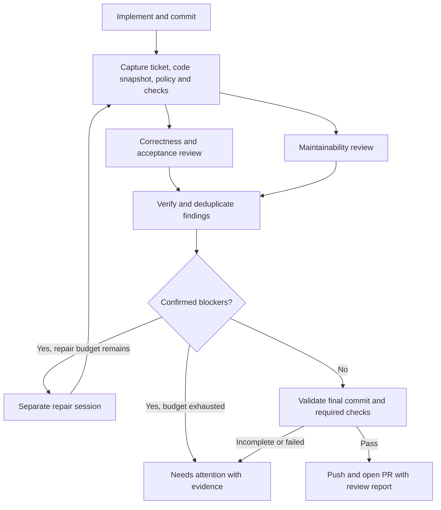

# Proposed code review strategy for Iteris

Research date: 17 September 2026. Code inspected: `bbba0a1`. This is the original design proposal. The core gate, independent passes, bounded repair, policy, resume, standalone review command, and evaluation tooling are now implemented; see the README for shipped behavior. Cross-model selection, learned rules, external providers, and sandboxed arbitrary reproduction scripts remain future experiments.

**Recommendation: make Iteris responsible for demonstrating that a ticket is ready for human review.** Use independent correctness and maintainability passes, verify their findings, repair within a bounded loop, and gate PR creation on evidence tied to the final commit. Keep the workflow local and compatible with either existing harness.

## What is weak today

The implementation already has useful foundations: a fresh review process, cancellation and timeouts, assistant-only completion signals, phase retries, and a separate PR-description process. The missing piece is a review contract that the application can enforce.

| Current behavior | Why it matters | Evidence |
| --- | --- | --- |
| One `runHarness` call receives a prompt naming four specialists. | Iteris does not orchestrate or record independent specialist reviews. The model may choose to delegate, but the application cannot rely on that. | [reviewer.ts](https://github.com/Oscar-Codes-Life/Iteris/blob/bbba0a12940d2740766a48a0deff181eb257c283/src/agent/reviewer.ts#L40) |
| The review prompt substitutes only ticket number, title, and base branch. | The reviewer is not explicitly supplied the ticket body, acceptance criteria, plan, or configured checks. It can inspect the repo, but essential context is left to discovery. | [reviewer.ts](https://github.com/Oscar-Codes-Life/Iteris/blob/bbba0a12940d2740766a48a0deff181eb257c283/src/agent/reviewer.ts#L35) |
| The same review session diagnoses, fixes, commits, and pushes. | Its fixes have no required independent review. A repair can introduce a new defect. | [review template](https://github.com/Oscar-Codes-Life/Iteris/blob/bbba0a12940d2740766a48a0deff181eb257c283/src/github/commands/code-review.md#L48) |
| Successful exit plus `<task>done</task>` completes review. | The host does not inspect unresolved findings, check exit codes, coverage, or the reviewed commit before continuing. | [runner.ts](https://github.com/Oscar-Codes-Life/Iteris/blob/bbba0a12940d2740766a48a0deff181eb257c283/src/agent/runner.ts#L89) |
| A boolean remembers that review completed. | A retry can reuse review without proving that the branch and policy are unchanged. | [runner.ts](https://github.com/Oscar-Codes-Life/Iteris/blob/bbba0a12940d2740766a48a0deff181eb257c283/src/agent/runner.ts#L56) |
| Review output is prose, requested to include a health score and top three concerns. | There is no structured finding lifecycle or measurable quality signal; a fixed concern count encourages filler. The `folder` argument is unused by the reviewer. | [review template](https://github.com/Oscar-Codes-Life/Iteris/blob/bbba0a12940d2740766a48a0deff181eb257c283/src/github/commands/code-review.md#L24), [reviewer.ts](https://github.com/Oscar-Codes-Life/Iteris/blob/bbba0a12940d2740766a48a0deff181eb257c283/src/agent/reviewer.ts#L25) |

These are control-flow and prompt findings from source inspection, not measurements of how often Iteris misses bugs. Existing runner tests exercise lifecycle, retry, and timeout behavior; they do not establish review accuracy.

## What to borrow from strong teams and products

The first three rows describe published engineering practices or internal use. CodeRabbit and Greptile describe product capabilities; their documentation is not independent evidence of superior accuracy.

| Source | Published approach | Adaptation for Iteris |
| --- | --- | --- |
| **Cursor: Thermo-Nuclear / Thermos** | The maintainability rubric challenges unnecessary abstractions, scattered conditions, unclear boundaries, and unjustified growth beyond 1,000 lines. The newer Thermos plugin separates deep correctness/security review from code-quality review and synthesizes their results. | Give structure its own pass, with a concrete simpler design and a behavior-preservation argument. Treat file length as a review trigger rather than an automatic failure. [Rubric](https://github.com/cursor/plugins/blob/main/cursor-team-kit/skills/thermo-nuclear-code-quality-review/SKILL.md), [Thermos](https://github.com/cursor/plugins/tree/main/thermos) |
| **Cursor: Bugbot** | Its January engineering account describes an early eight-pass voting pipeline with validation and deduplication, then a move to tool-driven investigation and dynamic context. It evaluates changes using annotated bugs and resolution outcomes. | Borrow verification, retrieval, deduplication, and evaluation. Eight reviewers are not a prerequisite. [Engineering account](https://cursor.com/blog/building-bugbot) |
| **Anthropic** | Its March launch describes the system used on nearly every internal PR: parallel investigation, verification, severity ranking, and more review effort for complex changes. Humans retain approval. | Scale investigation with risk and preserve a clear distinction between automated readiness and human merge approval. [Code Review](https://claude.com/blog/code-review) |
| **Google** | Review should improve overall code health without demanding perfection. Small, self-contained changes are easier to assess. | Block meaningful regressions; keep optional refactoring from indefinitely expanding a ticket. [Review standard](https://google.github.io/eng-practices/review/reviewer/standard.html), [Small changes](https://github.com/google/eng-practices/blob/master/review/developer/small-cls.md) |
| **CodeRabbit** | Documents repository context, tool-backed verification, and comparison of PRs against linked issues. | Check whether the ticket is actually fulfilled and attach executable evidence where possible. [Context and verification](https://www.coderabbit.ai/blog/context-engineering-ai-code-reviews), [Issue assessment](https://docs.coderabbit.ai/pr-reviews/walkthroughs) |
| **Greptile** | Documents scoped repository rules, referenced architecture/schema files, and suggested rules derived from patterns. | Add versioned, path-specific review policy and explicit context links. [Custom standards](https://www.greptile.com/docs/code-review/custom-standards) |

Vendor-reported resolution rates, incorrect-comment rates, and bug counts use different denominators. They should not be treated as a comparable leaderboard or as Iteris performance targets.

## Proposed workflow

**1. Capture the review target and intent.** Iteris resolves and records the target branch tip, merge base, and implementation HEAD. It supplies the full ticket, explicit acceptance criteria, relevant plan, changed-file list, diff, configured checks, and repository rules. Plans are context, not proof that the implementation is correct. Distinguish written requirements from inferred expectations; surface ambiguous requirements without inventing new scope.

Review the full changed functions and relevant callers, consumers, schemas, and tests. Retrieve additional context on demand. Record inspected and omitted areas; an oversized diff must be partitioned or reported incomplete, never silently truncated and passed. Generated artifacts and lockfiles need appropriate consistency checks even when excluded from line-by-line model review.

Preserve unexpected working-tree edits and stop snapshot creation until their ownership is resolved. Known repairs from an interrupted run may be recovered and committed as a new review target. Do not combine an old commit verdict with unidentified local changes.

**2. Run independent review passes.** Start with two fresh contexts using the selected harness. Iteris explicitly schedules them and collects separate results; naming personas in a single prompt is insufficient.

| Pass | Questions it must answer |
| --- | --- |
| Correctness and acceptance | Does each ticket requirement have an implementation and relevant evidence? What breaks on retries, cancellation, partial failure, malformed input, or changed API contracts? Does the change create a security exposure? |
| Maintainability | Does the change add avoidable state, special cases, duplication, or indirection? Is logic in its canonical layer? Can a specific alternative remove concepts while retaining behavior? |
| Additional risk specialist, when triggered | For auth, credentials, subprocesses, migrations, shared contracts, or concurrency: trace the affected boundary. For a hot path: establish workload and evidence before alleging a performance regression. |

All changes get basic correctness and security scrutiny. A one-line permission change can warrant the deepest review. Diff size alone must not select review depth.

For Iteris itself, useful invariants include preserving one execution selection throughout a ticket and retries, preventing completion markers from bypassing failures, avoiding duplicate external actions on retry, retaining config during migration, and keeping source-provider semantics separate from PR delivery.

Reviewers inspect an immutable snapshot and cannot edit the working branch or push. The current `review` phase has write-capable permissions; change that explicitly. Claude's existing planning tool restriction also prevents command execution, so merely renaming review to planning would be insufficient. Let the host capture Git evidence and run checks, while reviewers use restricted read/search tools. Dynamic reproduction runs in a disposable execution environment that cannot mutate the ticket checkout or publish changes. A Git worktree alone does not provide process isolation.

**3. Verify findings before repair.** A fresh verifier attempts to disprove each candidate: inspect callers and guards, confirm the reported location, distinguish pre-existing defects from regressions, and check the actual trigger. Confirm a defect through a targeted reproduction or a concrete causal trace. A failed test is useful evidence, but not mandatory when the failure follows clearly from the code.

For a structural finding, require the current design cost, the simpler alternative, and why the alternative preserves behavior. Reject vague preferences such as “use a factory” without a demonstrated benefit. A single verified security finding remains valid even if other passes missed it; agreement is corroboration, not a veto.

**4. Repair with bounded scope.** A separate writer receives confirmed blocking findings and evidence. Start with at most two repair cycles. It fixes the issue and adds or updates a meaningful regression test when applicable. Broad unrelated redesign becomes a suggested follow-up, not automatic ticket expansion.

Every repair produces a new snapshot. Recheck affected findings and inspect the repair for regressions; retain an integrated view of the complete ticket diff. Reuse untouched analysis only when its code and dependencies remain valid. Stop if the same blocker persists, new blockers keep appearing, or the total budget is exhausted.

**5. Let the host decide readiness.** The final result is computed from validated artifacts. A model's prose verdict cannot override it. Before publication, required checks and review must refer to the final HEAD, and the pushed branch must match that HEAD. Any later mutation invalidates the affected evidence.

An empty check list is not evidence of successful validation. Detect and propose appropriate repository commands, but record validation as unavailable unless repository policy explicitly permits a check-free change type. Do not automatically execute arbitrary commands suggested by ticket text. Preserve command identity, exit status, and output; confirm checks did not alter tracked source. Re-run required checks after repairs. Compare a suspected regression against the base when feasible, while keeping known baseline failures visible.

## Findings, policy, and output

Use a Zod-validated report. Each finding records:

- Stable ID; category and priority; status (`candidate`, `confirmed`, `rejected`, `fixed`, or `accepted-risk`).
- Reviewed commit, file, line range, and relevant requirement or policy rule.
- Trigger, actual versus expected behavior, impact, and introduction/reachability evidence.
- Reproducer or causal trace, verification result, proposed remedy, and repair commit if resolved.

Keep severity separate from confidence. A severe but unverified allegation is still unverified. Remove the arbitrary health score, mandatory top-three concerns, and repetitive action-plan sections. Zero findings is a valid result when required coverage is complete.

| Outcome | Rule |
| --- | --- |
| `passed` | All required passes and checks completed on the final snapshot; no unresolved blockers; acceptance criteria covered. Advisory findings may remain and must be disclosed. |
| `blocked` | Confirmed critical/high defect, missing explicit requirement, or demonstrated material architectural regression remains. |
| `incomplete` | Required context/check unavailable, reviewer failure, malformed report, stale snapshot, or exhausted investigation budget. This is never converted to pass. |

File size and complexity deltas trigger inspection. They block only when the reviewer demonstrates a material regression or an explicit repository policy requires it. A medium/low issue is advisory by default unless it violates an explicit acceptance criterion or configured blocking rule. Risk acceptance must name an owner and reason; the repair agent cannot grant its own exception.

For blocked or incomplete tickets, save the report and offer retry or skip using the existing queue flow. Do not apply successful-completion actions such as moving a Trello card. Default to retaining local work without a ready PR; an explicitly configured draft-PR path can expose unfinished work while retaining the blocked status. Automated review never means automatic merge.

Persist `review/context.json`, per-pass reports, `findings.json`, `checks.json`, and `review.md` inside the existing run folder. Store base/head identifiers, ticket and policy digests, prompt/schema versions, reviewer selections, command exit codes, timings, and coverage gaps. Checkpoint reuse requires a matching snapshot and settings, not a boolean. Retain prior rounds for diagnosis across restarts.

The terminal and PR should summarize: reviewed commit, acceptance coverage, checks actually run, findings fixed, remaining blockers/advice, and unverified areas. Render this evidence deterministically; the PR-description model can write narrative around it. Local artifact paths cannot serve as links for remote reviewers, so embed the useful report in the PR body.

## Defaults and cost control

Suggested modes are design proposals, not existing CLI options:

| Mode | Behavior |
| --- | --- |
| `standard` (default) | Two independent passes, verification of candidates, configured checks, at most two repair cycles. |
| `deep` | Standard plus relevant risk specialists and more reproduction/context budget; selected explicitly or by policy. |
| `audit` | Broad structural exploration on explicit request; reports proposals without expanding the shipping ticket automatically. |

Skip an unnecessary architectural investigation for a documentation-only change, but record why. Cap concurrency at two initially, and apply one total review deadline across retries, verification, checks, and repairs. Benchmark a 15-minute standard and 30-minute deep budget as starting experiments; these are not performance promises. Reserve time for final validation and report incomplete when time expires.

Inherit the user's chosen harness/model/effort by default. Later permit a separately configured reviewer selection and snapshot it at ticket start. Cross-model review is an experiment to measure; requiring two providers would add setup and cost without established benefit for Iteris. Record usage when exposed; label unavailable cost data rather than guessing.

Add a versioned `REVIEW.md` for domain invariants and path-specific expectations. Resolve policy from the trusted base so the implementation cannot quietly weaken its own gate. Treat ticket text, code comments, and retrieved content as review data, not authority to alter permissions or policy. Feedback can propose rule updates with provenance; it should not silently suppress future findings.

## Build order

**First increment: trustworthy completion.** Supply missing ticket/check context; introduce the report schema and persisted artifacts; run configured checks from the host; record exact snapshots; make blocked/incomplete results stop successful completion. Keep a single investigator temporarily if necessary. This delivers more trust than immediately adding many agents.

**Second increment: independent judgment and repair.** Add correctness and maintainability sessions, the verifier, restricted permissions, and bounded repair/re-review. Extract review orchestration behind one cohesive module so ticket delivery continues to consume a simple typed result.

**Third increment: calibrated depth and reuse.** Add risk routing, explicit policy, snapshot-aware resume, and optional review-only use on an existing branch. Only add learned rules or external review-provider integrations after a local evaluation demonstrates value.

Likely integration points:

| Existing area | Required change |
| --- | --- |
| `src/agent/reviewer.ts` and review template | Build context, schedule passes, validate reports, verify findings, coordinate bounded repairs. Move domain-neutral prompts out of the GitHub-specific folder. |
| `src/harness/process.ts` | Distinguish read-only investigation from repair; preserve process failure and usage evidence. |
| `src/agent/runner.ts` | Consume typed review outcomes; validate checkpoints and final branch identity before publication/completion. |
| `src/types.ts`, `src/config.ts`, state/UI | Add review policy, outcome, selection, budgets, artifacts, and visible blocker status with backward-compatible defaults. |
| `src/agent/pr-description.ts` | Use authoritative final review/check evidence and deterministically include the readiness report. |

The desired end state moves commit/push verification into the host and publishes after the review gate. Today the implementation agent already pushes before review, so changing that ordering requires an explicit prompt/orchestration change; adding a final gate alone does not prevent earlier branch publication.

## How to tell whether it is better

Build a small evaluation corpus before broad rollout: start with roughly 30 historical or realistic change pairs, including clean changes, known bugs, acceptance gaps, and maintainability regressions. Include both harnesses. Keep a holdout set and repeat selected cases to expose nondeterminism. This initial corpus is a smoke benchmark, not a precise production accuracy estimate.

Use the current review as the baseline with matched models and budgets. Human-label whether findings are valid, relevant, duplicated, and actionable. Judge final patches separately from the review that produced them.

Measure confirmed-finding precision, known-defect recall, false blocking on clean changes, acceptance-gap detection, repair-induced regressions, escaped defects after review, median/p95 duration, and cost when observable. Treat resolution as one signal: an autonomous fixer accepting every suggestion would otherwise manufacture a perfect resolution rate.

Initial product targets to calibrate: at least 90% human-confirmed precision for blocking findings; improved known-defect recall over baseline; no regression in clean-change false blocks or repair safety. Do not declare these achieved without evaluation. First run the new gate in an explicit observation mode on pilot tickets, record hypothetical decisions, then enable enforcement when the evidence supports it. Observation mode must never label incomplete review as passed.

Add deterministic integration cases for malformed output, a completion marker with unresolved blockers, failing/skipped checks, changed HEAD after review, stale checkpoints, dirty worktrees, interruption, repeated findings, exhausted repair budgets, and blocked tickets not triggering completion actions. Preserve existing lifecycle tests. Model-quality evaluations and process tests answer different questions; both are needed.

**The useful product promise:** Iteris turns a ticket into a PR with independently examined changes, verified fixes, and explicit remaining uncertainty. The user can see why the change is ready and what still needs judgment.
